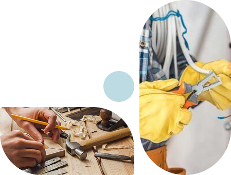

<p align="center">
  
</p>

<h1 align="center">🛠 منصة إتقان (Etqan Platform)</h1>

<p align="center">
  <b>منصة متكاملة لربط العملاء بأفضل الحرفيين وشركات المقاولات، وتوفير متجر شامل للأدوات والمعدات</b>
</p>

<p align="center">
  
  
  
  
  
</p>

---

## 📝 عن المشروع


**إتقان** هي منصة إلكترونية رائدة تهدف إلى إحداث ثورة في سوق العمل الحرفي وخدمات المقاولات في مصر. نقوم بتسهيل عملية البحث عن الحرفيين المهرة لإنهاء أعمال الصيانة والتشطيبات بأنواعها، بالإضافة إلى توفير حلقة وصل موثوقة مع شركات المقاولات.

كما تمتد خدمات المنصة لتشمل متجراً إلكترونياً متكاملاً يوفر أفضل المعدات والأدوات التي يحتاجها الحرفيون والعملاء بأسعار تنافسية.

<br clear="both"/>

---

## 👥 المستخدمون (الفئات المستهدفة)

تم تصميم المنصة لتخدم **ثلاث فئات رئيسية** بنظام حسابات مخصص لتلبية احتياجات كل فئة:

<table>
  <tr>
    <td width="33%" align="center">
      <br/><br/>
      <b>🔧 الحرفيون (Craftsmen)</b>
    </td>
    <td width="33%" align="center">
      <br/><br/>
      <b>👤 العملاء (Customers)</b>
    </td>
    <td width="33%" align="center">
      <br/><br/>
      <b>🏢 الشركات (Companies)</b>
    </td>
  </tr>
</table>

### 👤 العملاء (Customers)
   * البحث عن الحرفيين المناسبين من خلال التصنيفات المختلفة.
   * طلب خدمات الصيانة والإنشاءات ومتابعة حالة الطلبات.
   * تصفح المنتجات وشرائها من متجر إتقان.
   * تقييم الحرفيين وكتابة التقييمات لضمان الشفافية.

### 🔧 الحرفيون (Craftsmen)
   * إنشاء ملف شخصي احترافي (Portfolio) يعرض مهاراتهم وتقييماتهم.
   * استقبال طلبات العمل من العملاء والتواصل المباشر معهم.
   * شراء الأدوات والمعدات اللازمة لأداء مهامهم عبر المتجر الخاص بالمنصة.

### 🏢 الشركات (Companies)
   * عرض سابقة الأعمال واستقبال طلبات المشاريع الكبرى (تشطيبات بمساحات كبيرة، بناء، الخ).
   * تقديم عروض الأسعار للعملاء وإدارة فرق العمل.

---

## 🚀 الخدمات الأساسية

<table>
  <tr>
    <td width="55%">
      <h3>🔗 ربط العميل بالحرفي</h3>
      <p>منصة ذكية لفلترة وتوصيل العملاء بأفضل الكفاءات (سباكة، نجارة، كهرباء، تكسير وإزالة، دهانات، تبريد وتكييف، وأكثر من 20 تخصص).</p>
      <h3>🛒 متجر إتقان (Store)</h3>
      <p>متجر لبيع العدد والأدوات من ماركات عالمية (DeWalt, Makita, Bosch) مع عروض قوية، وخرائط مدمجة لتحديد مواقع التوصيل.</p>
      <h3>🏗️ خدمات المقاولات</h3>
      <p>ربط العملاء بالشركات لإدارة مشاريع البناء والتشطيب المتكامل.</p>
      <h3>⭐ نظام التقييم والموثوقية</h3>
      <p>ضمان جودة الخدمات المقدمة من خلال مراجعات حقيقية من عملاء سابقين.</p>
    </td>
    <td width="45%" align="center">
      
    </td>
  </tr>
</table>

---

## 🗂️ هيكل صفحات التطبيق

```
📁 إتقان (Etqan)
├── 🏠 الصفحة الرئيسية (Index) — اختيار نوع المستخدم
├── 🔑 تسجيل الدخول / إنشاء حساب
│   ├── 👤 عميل (Customer)
│   ├── 🔧 حرفي (Craftsman)
│   └── 🏢 شركة (Company)
├── 🏡 الصفحة الرئيسية (Home)
│   ├── Hero Section — إحصائيات المنصة
│   ├── الخدمات الرئيسية
│   ├── أفضل الحرفيين (Swiper Slider)
│   ├── آراء العملاء
│   └── تواصل معنا
├── 🔧 صفحة الخدمات — 20+ تخصص حرفي مع بحث
├── 👷 صفحة الحرفيين — تصفح حسب التخصص
├── 🛒 المتجر — منتجات، عروض، ماركات عالمية + خريطة
├── 🛍️ سلة المشتريات و الفاتورة
├── 👤 بروفايل العميل / الحرفي
├── 📋 صفحة الطلبات (عميل / حرفي / شركة)
├── ℹ️ من نحن (About Us)
├── 📞 تواصل معنا (Contact)
└── 🔐 استعادة كلمة المرور (OTP Verification)
```

---

## 💻 التقنيات المستخدمة وسبب الاختيار


تم بناء وتطوير واجهة المستخدم الخاصة بالمشروع باستخدام أحدث تقنيات الـ Frontend لضمان السرعة، المرونة، وتجربة المستخدم الممتازة:

<br clear="both"/>

| التقنية (Technology) | مميزاتها | لماذا وقع الاختيار عليها؟ |
| :--- | :--- | :--- |
| **React.js (v19)** | مكتبة قوية ومستقرة لبناء واجهات المستخدم التفاعلية (SPA). | تعتمد على المكونات (Components) مما يسهل إعادة الاستخدام، إضافة إلى دعمها القوي والمجتمع الضخم، وهي مثالية لبناء منصات تفاعلية مثل إتقان. |
| **Vite** | أداة بناء وتطوير (Build Tool) خفيفة وسريعة. | بديل متطور لـ Webpack؛ تم اختياره لسرعته الفائقة في تشغيل السيرفر المحلي (Cold Start) وتحديثات الـ HMR اللحظية. |
| **React Router v7** | مكتبة لإدارة التنقل والمسارات في التطبيق. | أساسية للتطبيقات ذات الصفحة الواحدة (SPA)؛ توفر تنقلاً سلساً وبدون إعادة تحميل (Reload) للصفحة لراحة المستخدم. |
| **Swiper** | مكتبة لإنشاء أشرطة التمرير والـ Carousels. | الأفضل من حيث التجاوب (Responsive) مع الموبايل ودعم اللمس. تم استخدامها لعرض آراء العملاء وقوائم أفضل الحرفيين والمنتجات. |
| **Framer Motion & AOS** | مكتبات متخصصة في حركة العناصر والأنيميشن التفاعلي. | تم إضافتها لكسر جمود التصفح. **AOS** ممتاز للتأثيرات البسيطة عند عمل Scroll، بينما **Framer Motion** يوفر حركات متقدمة ومستقرة كالتي في الشاشة الرئيسية (Index). |
| **CSS Modules & Tailwind** | أدوات تنسيق الهيكل البصري. | لتوفير أقصى قدر من المرونة والدقة في بناء الـ UI الجذاب الذي يواكب أحدث صيحات تصميم الـ Web. |
| **Bootstrap 5** | إطار عمل CSS جاهز للتصميم المتجاوب. | يوفر مكونات جاهزة وشبكة (Grid System) مرنة لتسريع عملية التطوير وضمان التوافق مع جميع أحجام الشاشات. |
| **React-Leaflet** | مكتبة للتعامل مع الخرائط مفتوحة المصدر. | تم اختيارها لدمج الخريطة في صفحة المتجر، حيث تساعد العميل على تحديد موقع التوصيل بضغطة زر بدقة عالية. |
| **React Icons** | مكتبة أيقونات ضخمة تدعم FA, Material, وغيرها. | تم اختيارها لتوفير أيقونات متسقة وعالية الجودة في جميع أنحاء التطبيق دون الحاجة لملفات SVG منفصلة. |
| **React Select** | مكتبة لقوائم الاختيار المتقدمة. | تم اختيارها لتوفير تجربة بحث وتصفية سلسة في قوائم التخصصات والمناطق. |

---

## ⚙️ التشغيل المحلي للمشروع (Local Development)

لنسخ المشروع وتشغيله على جهازك المحلي اتبع الخطوات التالية:

1. **استنساخ المشروع:**
   ```bash
   git clone https://github.com/khaled-el-badawy/etqan.git
   cd etqan
   ```

2. **تثبيت الحزم البرمجية والاعتماديات:**
   ```bash
   npm install
   ```

3. **تشغيل السيرفر المحلي:**
   ```bash
   npm run dev
   ```

4. **بناء المشروع لنسخة الإنتاج (Production):**
   ```bash
   npm run build
   ```

---

## 📸 لقطات من المنصة

<p align="center">
  
  &nbsp;&nbsp;&nbsp;&nbsp;
  
</p>

---

<p align="center">
  
  <br/><br/>
  <b>✨ كل شيء بإتقان ✨</b>
  <br/><br/>
  صُنع بـ ❤️ بواسطة فريق إتقان
</p>
