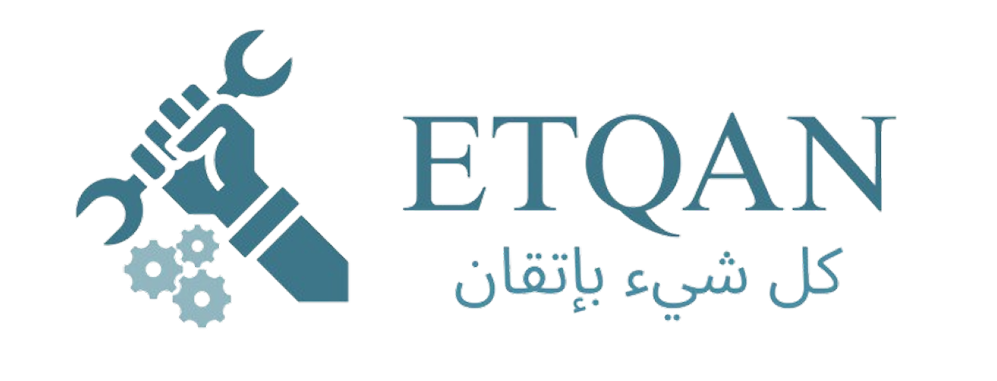

<p align="center">
  
</p>

<h1 align="center">🛠 منصة إتقان — Etqan Platform</h1>

<p align="center">
  <b>منصة رقمية متكاملة تربط العملاء بالحرفيين المهرة وشركات المقاولات، مع متجر احترافي للأدوات والمعدات في مصر</b>
</p>

<p align="center">
  
  
  
  
  
  
</p>

---

## 📝 نظرة عامة على المشروع


**إتقان** هي منصة إلكترونية رائدة تهدف إلى إحداث نقلة نوعية في سوق الخدمات الحرفية والمقاولات في مصر. اسم "إتقان" يعكس رسالة المنصة الأساسية: تقديم خدمات حرفية عالية الجودة من خلال تجربة رقمية حديثة ومتطورة.

المنصة تعمل كـ **سوق رقمي ثلاثي الأطراف** يربط بسلاسة بين **العملاء** الباحثين عن خدمات الصيانة والتجديد والبناء، و**الحرفيين المعتمدين** في أكثر من 20 تخصصاً حرفياً، و**شركات المقاولات** القادرة على إدارة المشاريع الكبرى. بالإضافة إلى ذلك، تضم المنصة **متجراً إلكترونياً متكاملاً** يوفر أدوات ومعدات احترافية من علامات تجارية عالمية مثل DeWalt وMakita وBosch وMilwaukee وKNIPEX.

تم بناء المنصة بالكامل كـ **تطبيق صفحة واحدة (SPA)** باستخدام React 19 وVite 7، مع التركيز على السرعة والتفاعلية وتجربة المستخدم المتميزة.

<br clear="both"/>

---

## 👥 الفئات المستهدفة

تم تصميم المنصة لتخدم **ثلاث فئات رئيسية**، لكل منها نظام تسجيل وملف شخصي وإدارة طلبات مخصصة:

<table align="center">
  <tr>
    <td width="33%" align="center"><b>👤 العملاء</b></td>
    <td width="33%" align="center"><b>🔧 الحرفيون</b></td>
    <td width="33%" align="center"><b>🏢 الشركات</b></td>
  </tr>
</table>

### 👤 العملاء
- تصفح والبحث عن حرفيين في أكثر من 20 تخصص حرفي
- إرسال طلبات خدمة وتتبع حالة الطلبات
- التسوق من متجر إتقان للأدوات والمعدات
- تقييم الحرفيين وكتابة مراجعات لضمان الشفافية
- إدارة الملف الشخصي مع سجل الخدمات وتقديم الشكاوى
- التواصل المباشر مع الحرفيين عبر نظام المحادثة المدمج

### 🔧 الحرفيون
- بناء ملف شخصي احترافي يعرض المهارات والخبرات ومعرض الأعمال والتقييمات
- استقبال وإدارة طلبات العمل من خلال لوحة طلبات مخصصة
- شراء الأدوات والمعدات اللازمة من متجر المنصة
- تعديل بيانات الملف الشخصي مع التحقق من العمر (18 سنة كحد أدنى)

### 🏢 الشركات
- إنشاء ملف شركة شامل يعرض الخدمات والخبرات وسابقة الأعمال
- استقبال طلبات المشاريع الكبرى (بناء، تشطيبات، نقل مواد، تأجير معدات)
- إدارة طلبات الشركة والتفاعل مع العملاء

---

## ⚒️ الخدمات الأساسية

| الخدمة | الوصف |
| :--- | :--- |
| **🔗 ربط العميل بالحرفي** | نظام فلترة وتصفح ذكي يربط العملاء بأفضل الكفاءات في 20+ تخصص — سباكة، نجارة، كهرباء، حدادة، تكييف، دهانات، محارة، بناء، سيراميك، ألومنتال، تكسير، رش مبيدات، وأكثر. |
| **🛒 متجر إتقان** | متجر إلكتروني متكامل للأدوات من ماركات عالمية مع بحث، خصومات، مفضلة، سلة مشتريات، تقييمات، وخرائط Google لتحديد موقع التوصيل. |
| **🏷️ كتالوج الماركات** | صفحة ماركات ضخمة تعرض **72 منتج** من **8 ماركات عالمية** (Makita، Bosch، DeWalt، Milwaukee، Metabo، Snap-on، RYOBI، KNIPEX، BAHCO) — لكل ماركة هيدر مخصص، متوسط تقييم، بحث بالاسم والسعر، وإضافة للمفضلة والسلة. |
| **🏗️ خدمات المقاولات** | دليل شركات متخصص في البناء والتشطيب ونقل المخلفات ونقل الرمل والزلط وتأجير المعدات الثقيلة ونقل الأثاث. |
| **📋 دليل مزودي الخدمات** | صفحة Providers ديناميكية تعرض الشركات حسب نوع الخدمة المختار (مقاولات، نقل مخلفات، تأجير معدات...) مع بطاقات تفاعلية تنقل لملف الشركة. |
| **📦 تفاصيل المنتج** | صفحة مفصلة لكل منتج مع معرض صور متعدد (Image Gallery)، تحكم بالكميات، إضافة للسلة والمفضلة، تقييمات المستخدمين مع إمكانية إضافة تقييم جديد، ومنتجات مشابهة. |
| **📊 تتبع الطلبات** | نظام تتبع متقدم بـ **5 مراحل** (إرسال → قبول → معاينة → تنفيذ → انتهاء) مع Modal تفاعلي يعرض مؤشرات مرئية وتوقيتات لكل مرحلة. |
| **⭐ نظام التقييم** | نظام مراجعات وتقييمات شفاف مع أشرطة توزيع التقييمات وإمكانية تقديم الشكاوى — مع نجوم تفاعلية ومودال تقييم ومودال شكوى. |
| **💬 محادثة فورية** | نظام رسائل مدمج مع قائمة محادثات، بحث، مؤشرات حالة الاتصال، مرفقات صور (سحب وإفلات)، وشارات الرسائل غير المقروءة. |

---

## 🗂️ هيكل صفحات التطبيق

يتكون التطبيق من **25+ صفحة/عرض** مُدارة عبر React Router v7:

```
📁 إتقان (Etqan)
├── 🏠 صفحة الهبوط
├── 🔑 نظام المصادقة
│   ├── تسجيل الدخول
│   ├── تسجيل الدخول بـ OTP
│   ├── نسيت كلمة المرور
│   ├── التحقق من OTP
│   ├── كلمة مرور جديدة
│   ├── تسجيل عميل
│   ├── تسجيل حرفي
│   ├── تسجيل شركة
├── 🏡 الصفحة الرئيسية
├── 🔧 صفحة الخدمات
├── 👷 صفحة الحرفيين
├── 🏢 دليل الشركات
├── 📋 مزودي الخدمات
├── 🛒 المتجر
├── 🏷️ صفحة الماركات
├── 📦 تفاصيل المنتج
├── ❤️ المفضلة
├── 🛍️ سلة المشتريات
├── 🧾 الفاتورة
├── 👤 الملفات الشخصية
│   ├── ملف الحرفي
│   ├── ملف الشركة
│   └── ملف العميل
├── 📋 إدارة الطلبات
│   ├── طلبات العميل
│   ├── طلبات الحرفي
│   └── طلبات الشركة
├── 🔍 تفاصيل الطلب
├── 📊 لوحة التحكم (Dashboard)
│   ├── إدارة الحرفيين (Dashartisans)
│   ├── إدارة العملاء (Dashcustomer)
│   └── إدارة المنتجات (Dashproducts)
├── 💬 صفحة المحادثة
├── ℹ️ من نحن
├── 📞 تواصل معنا
└── 🚫 صفحة 404
```

---

## 💻 التقنيات المستخدمة


تم بناء واجهة المستخدم باستخدام أحدث التقنيات لضمان السرعة والمرونة وتجربة المستخدم الممتازة:

<br clear="both"/>

| التقنية | الإصدار | الغرض وسبب الاختيار |
| :--- | :---: | :--- |
| **React.js** | 19.2 | مكتبة بناء واجهات المستخدم التفاعلية باستخدام المكونات الوظيفية والـ Hooks. تم اختيارها لنظامها البيئي الضخم واستقرارها وملاءمتها لبناء منصات SPA تفاعلية. |
| **Vite** | 7.2 | أداة بناء وتطوير فائقة السرعة مع HMR لحظي. تم اختيارها بدلاً من Webpack لأدائها المتفوق في التشغيل البارد وبنيتها الحديثة. |
| **React Router** | 7.13 | إدارة التنقل والمسارات الديناميكية (`:role`، `:id`). يوفر تنقلاً سلساً بدون إعادة تحميل الصفحة. |
| **Framer Motion** | 12.29 | مكتبة أنيميشن متقدمة لتحريك العناصر في صفحة الهبوط بتأثيرات دخول وتعويم احترافية. |
| **AOS** | 2.3 | أنيميشن عند التمرير (`fade-up`، `zoom-in`، `flip-left`) مطبق على جميع الأقسام لإضافة حيوية بصرية. |
| **Swiper** | 12.1 | مكتبة سلايدر تدعم اللمس مع تشغيل تلقائي وترقيم. مستخدمة لعرض أفضل الحرفيين وآراء العملاء. |
| **Bootstrap** | 5.3 | إطار CSS يوفر نظام شبكة متجاوب ومكونات جاهزة لجميع أحجام الشاشات. |
| **Tailwind CSS** | 4.1 | إطار CSS مدمج عبر PostCSS لتنسيق سريع ودقيق إلى جانب ملفات CSS المخصصة. |
| **React-Leaflet** | 5.0 | مكتبة خرائط مفتوحة المصدر لتحديد موقع التوصيل في صفحة المتجر عبر Google Maps. |
| **React Icons** | 5.5 | مكتبة أيقونات شاملة تدعم Font Awesome وMaterial Design وFeather وغيرها. |
| **React Select** | 5.10 | مكون قوائم اختيار متقدمة مع بحث وفلترة لاختيار التخصصات والمناطق. |
| **ESLint** | 9.39 | أداة فحص جودة الكود مع إضافات React Hooks وReact Refresh. |
| **PostCSS + Autoprefixer** | 8.5 / 10.4 | معالجة CSS لضمان التوافق مع جميع المتصفحات. |
| **gh-pages** | 6.3 | أداة نشر على GitHub Pages. |

### منهجية التصميم والتنسيق

- **ملفات CSS مخصصة لكل مكون** (مثل: `Home.jsx` ← `HomeStyle.css`) لعزل الأنماط
- **خطوط Google عربية** — Almarai، El Messiri، Lateef + خطوط لاتينية: Montserrat، Ubuntu، Work Sans
- **شريط تمرير مخصص** بلون تيل (`#3e7c87`) متوافق مع هوية المنصة البصرية
- **دعم كامل للعربية (RTL)** — واجهة عربية بالكامل مع محاذاة واتجاه صحيح

---

## 🌟 الميزات والمزايا الرئيسية

### ميزات المنصة

| الميزة | الوصف |
| :--- | :--- |
| **مصادقة متعددة الأدوار** | تسجيل وتسجيل دخول منفصل لكل نوع مستخدم مع حقول مخصصة وتحقق OTP واستعادة كلمة المرور. |
| **نظام OTP متقدم** | رمز تحقق من 4 خانات مع انتقال تلقائي بين الحقول، عداد تنازلي 60 ثانية، زر إعادة إرسال، واستدعاء API جاهز (`/api/verify-otp`) مع معالجة الأخطاء. |
| **قواعد كلمة المرور الفورية** | تحقق مرئي فوري أثناء الكتابة: يجب أن تبدأ بحرف كبير (Capital) + رمز خاص (!@#$%) + 8 أحرف كحد أدنى — مع تلوين أخضر/أحمر فوري لكل قاعدة. |
| **تسجيل حرفي متقدم** | حقول خاصة: تاريخ الميلاد مع منتقي تقويم (date picker) وفحص عمر 18+، الحالة الاجتماعية (قائمة منسدلة)، الرقم القومي (14 رقم بالضبط)، واختيار المهنة من 21 تخصص مع بحث ديناميكي. |
| **تسجيل شركة مع رفع ملفات** | رفع السجل التجاري (PDF/JPG/PNG) عبر حقل ملف مخصص مع أيقونة مجلد وعرض اسم الملف المرفوع. |
| **اختيار المحافظة بالبحث** | قائمة منسدلة ذكية لـ 27 محافظة مصرية مع فلترة فورية أثناء الكتابة وإغلاق تلقائي عند النقر خارج القائمة. |
| **20+ تخصص حرفي** | تغطية شاملة للحرف: سباكة، نجارة، كهرباء، حدادة، تكييف، دهانات، محارة، بناء، سيراميك، ألومنتال، تكسير، غاز، منجد، نقل، صيانة أجهزة، رش مبيدات، تنظيف، فني دش، فني كاميرات، أمن ذكي، استشارات هندسية. |
| **ملفات شخصية غنية للحرفيين** | بورتفوليو مع صور غلاف قابلة للتعديل، أفاتار، شارة توثيق، معرض أعمال (Lightbox)، تقييمات مع توزيع بياني (5 أشرطة)، ونموذج طلب خدمة مع اختيار محافظة. |
| **كتالوج ماركات ضخم** | **72 منتج** من **8 ماركات عالمية** (Makita، Bosch، DeWalt، Milwaukee، Metabo، Snap-on، RYOBI، KNIPEX، BAHCO) — لكل ماركة صفحة مخصصة بهيدر، بحث، متوسط تقييم، مفضلة localStorage، وإضافة للسلة. |
| **متجر إلكتروني متكامل** | كتالوج مع سلايدر، خصومات، بحث، مفضلة (localStorage)، سلة بحد أقصى 5 قطع، تقييم منتجات، ودليل ماركات. |
| **تفاصيل منتج متقدمة** | صفحة مفصلة مع معرض صور (Image Gallery) قابل للنقر، تحكم بالكميات، حالة المخزون، تقييمات المستخدمين، إضافة تقييم جديد، ومنتجات مشابهة (Related Products). |
| **تحديد موقع جغرافي** | دمج Geolocation API مع خرائط Google لتحديد موقع التوصيل. |
| **نظام تتبع طلبات بـ 5 مراحل** | Modal تفاعلي يعرض مراحل الطلب (إرسال → قبول → معاينة → تنفيذ → انتهاء) مع أيقونات تأكيد ✓ وتوقيتات لكل مرحلة — مع قفل التمرير أثناء العرض. |
| **فلاتر الطلبات** | 5 تصنيفات (الكل / مكتمل / قيد التنفيذ / في الانتظار / ملغى) مع أزرار إجراء مختلفة حسب الحالة (تقييم/فاتورة/تتبع/تفاصيل/إعادة طلب). |
| **إلغاء طلب ذكي** | إلغاء الطلب مع تمرير برمجي لأعلى الصفحة، تحديث الرسالة فوراً، وإعادة توجيه تلقائي بعد ثانيتين. |
| **محادثة فورية** | واجهة رسائل كاملة مع قائمة محادثات، بحث، مؤشرات اتصال، مرفقات صور (سحب وإفلات + اختيار ملف). |
| **فاتورة مفصلة** | صفحة فاتورة مع بيانات الحرفي والعميل وجدول خدمات مفصل وملخص أسعار وطرق دفع متعددة. |
| **إحصائيات متحركة** | عدّادات أرقام متحركة باستخدام Intersection Observer على قسم الـ Hero. |
| **تحقق متقدم من النماذج** | بريد إلكتروني (regex)، هاتف مصري (01x — 010/011/012/015 فقط، 11 رقم)، رقم قومي (14 رقم)، تطابق كلمات المرور، تاريخ ميلاد مع فحص عمر 18+. |
| **تصميم متجاوب بالكامل** | تخطيطات متجاوبة من الموبايل (320px) إلى سطح المكتب مع قائمة هامبرجر وشبكات تكيفية. |
| **صفحة 404 مخصصة** | صفحة خطأ مخصصة للمسارات غير الموجودة. |

### المزايا التقنية

- **تنقل بدون إعادة تحميل** — بنية SPA تضمن انتقالات فورية بين الصفحات
- **تحميل أصول محسّن** — نهج SVG أولاً للأيقونات والرسوم لتقليل حجم البيانات
- **عزل الحالة** — إدارة حالة على مستوى المكون باستخدام React Hooks
- **عرض شرطي ذكي** — إخفاء Navbar وFooter تلقائياً في صفحات المصادقة والهبوط
- **إدارة التمرير** — تمرير برمجي لأعلى الصفحة عند التحميل مع استراتيجية متعددة المؤقتات
- **تحقق النماذج في الوقت الفعلي** — قواعد كلمة المرور تتلون لحظياً أثناء الكتابة (أخضر/أحمر)
- **إغلاق القوائم بالنقر خارجها** — جميع القوائم المنسدلة تُغلق تلقائياً بالنقر خارج حدودها عبر `mousedown` listener
- **صور دور مخصصة** — كل صفحة مصادقة تعرض صورة SVG مختلفة حسب نوع المستخدم مع أنيميشن تعويم لا نهائي
- **قفل التمرير في المودال** — `document.body.style.overflow = "hidden"` عند فتح أي Modal مع استعادته عند الإغلاق

---

## 📚 الدروس المستفادة

### الهندسة المعمارية وأنماط التصميم
- **البنية القائمة على المكونات**: هيكلة تطبيق كبير (25+ صفحة، 30+ مكون) إلى وحدات قابلة لإعادة الاستخدام عزّز أهمية نمط التركيب في React.
- **التوجيه المبني على الأدوار**: تنفيذ مسارات ديناميكية بمعاملات (`:role`، `:id`) علّم أنماطاً فعالة للتطبيقات متعددة أنواع المستخدمين.
- **إدارة الحالة المعقدة**: التعامل مع حالات النماذج المعقدة (تحقق متعدد الخطوات، أقنعة إدخال، أزرار إظهار كلمة المرور) أظهر قوة وحدود Hooks.

### هندسة واجهة المستخدم
- **تناغم مكتبات الأنيميشن**: الجمع بين Framer Motion وAOS أظهر كيف يمكن لأنظمة أنيميشن متعددة التعايش — مع ضرورة إدارة التمرير بعناية لمنع التعارضات.
- **تعقيد تصميم RTL**: بناء واجهة عربية كاملة تطلب فهماً عميقاً لعرض النص ثنائي الاتجاه والتخطيطات المعكوسة.
- **أفضل ممارسات UX للنماذج**: تنفيذ قناع تاريخ الميلاد (`--/--/----` مع ملء تلقائي ومعالجة الحذف وتحريك المؤشر ومنتقي التقويم) أظهر تعقيد إنشاء حقول إدخال سهلة الاستخدام.

### أنماط التجارة الإلكترونية
- **إدارة السلة على جانب العميل**: استخدام localStorage لحفظ السلة والمفضلة وفّر فهماً عملياً لأنماط البيانات غير المتصلة.
- **بنية البحث والفلترة**: تنفيذ بحث فوري عبر المنتجات والخدمات والمحادثات عزّز تقنيات فلترة المصفوفات.

### العمق التقني
- **Intersection Observer API**: استخدامها للعدّادات المتحركة وفّر خبرة عملية بهذه الواجهة البرمجية للتفاعلات المبنية على التمرير.
- **معالجة الملفات في المتصفح**: ميزة مرفقات الصور في المحادثة (FileReader، سحب وإفلات، data URLs) عمّقت فهم معالجة الملفات.
- **Geolocation API**: دمج تحديد الموقع الجغرافي مع خرائط Google لميزة التوصيل.

---

## 🎯 الاستنتاجات

1. **بنية سوق رقمي شاملة**: النموذج ثلاثي الأطراف (عميل ↔ حرفي ↔ شركة) يثبت أن المنصات المعقدة يمكن هيكلتها بأناقة باستخدام نموذج مكونات React والتوجيه الديناميكي.

2. **تجربة مستخدم غنية**: مع 25+ صفحة متصلة وأنيميشن وسلايدر ومحادثة وتحديد موقع ومتجر إلكتروني كامل — المنصة تثبت قدرة تقنيات الفرونت إند الحديثة على تقديم تجارب غنية.

3. **نضج نظام التصميم**: النهج الهجين في التنسيق (CSS مخصص + Bootstrap + Tailwind + خطوط Google) يؤسس نظام تصميم مرن يدعم واجهة عربية RTL بجماليات عالية.

4. **جاهزية للربط بالباك إند**: التطبيق مُعد معمارياً للربط بالخادم — تدفقات المصادقة تتضمن قوالب API جاهزة، والنماذج تسجل بيانات منظمة.

5. **حل لمشكلة حقيقية**: إتقان تعالج فجوة حقيقية في سوق الخدمات الحرفية المصري من خلال رقمنة عملية اكتشاف وتوظيف الحرفيين مع دمج متجر إلكتروني وخدمات مقاولات.

6. **أساس تعليمي شامل**: المشروع يغطي كل جانب أساسي من تطوير الفرونت إند الحديث: توجيه SPA، إدارة الحالة، تحقق النماذج، أنيميشن، تصميم متجاوب، أنماط تجارة إلكترونية، محادثة فورية، تحديد موقع، ومعالجة ملفات.

---

## ⚙️ التشغيل المحلي

1. **استنساخ المشروع:**
   ```bash
   git clone http://github.com/khaled-el-badawy/etqan.git
   cd etqan
   ```

2. **تثبيت الحزم:**
   ```bash
   npm install
   ```

3. **تشغيل السيرفر المحلي:**
   ```bash
   npm run dev
   ```

4. **بناء نسخة الإنتاج:**
   ```bash
   npm run build
   ```

---

## 📂 هيكل المشروع

```
etqan/
├── public/images/           # الأصول الثابتة (أيقونات، صور منتجات، شعارات ماركات)
├── src/
│   ├── components/          # 30+ مكون React (JSX + CSS مخصص لكل مكون)
│   │   ├── Index.jsx        # صفحة الهبوط
│   │   ├── Home.jsx         # الصفحة الرئيسية
│   │   ├── Service.jsx      # شبكة التخصصات الحرفية
│   │   ├── Products.jsx     # متجر الأدوات
│   │   ├── Chat.jsx         # واجهة المحادثة
│   │   ├── CraftmanProfile.jsx  # ملف الحرفي
│   │   ├── CompanyProfile.jsx   # ملف الشركة
│   │   └── ...              # تسجيل، طلبات، سلة، فاتورة، إلخ
│   ├── App.jsx              # المكون الرئيسي مع إعدادات التوجيه
│   ├── main.jsx             # نقطة دخول التطبيق
│   └── index.css            # الأنماط العامة
├── index.html               # ملف HTML الرئيسي
├── vite.config.js           # إعدادات Vite
└── package.json             # التبعيات والأوامر
```

---

<p align="center">
  
  <br/><br/>
  <b>صُنع بإتقان بواسطة فريق إتقان</b>
  <br/>
  <sub>© 2026 منصة إتقان — جميع الحقوق محفوظة</sub>
</p>
